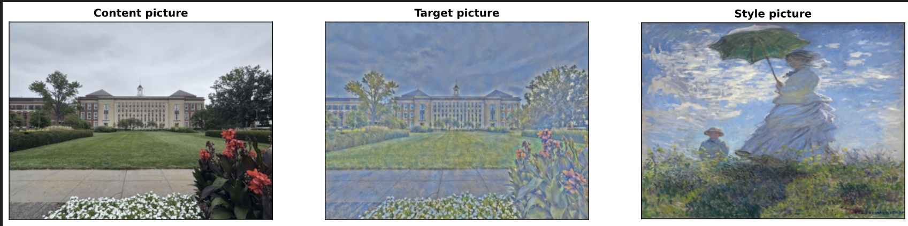

# Style Transfer algorithm

## Quickstart
```
pip install -r requirements.txt
```
Put your content picture and style picture in a working directory and just run all cells in `StyleTransfer.ipynb`


